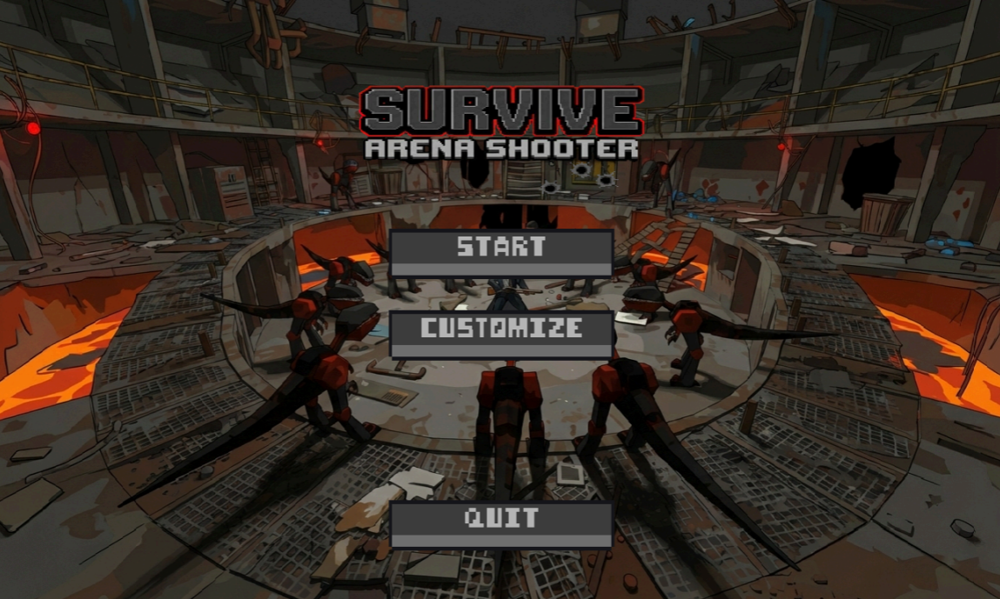
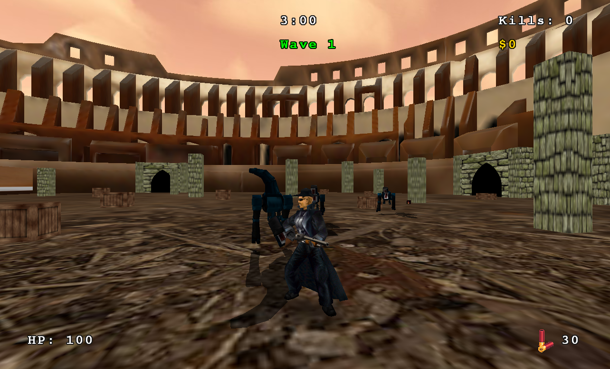
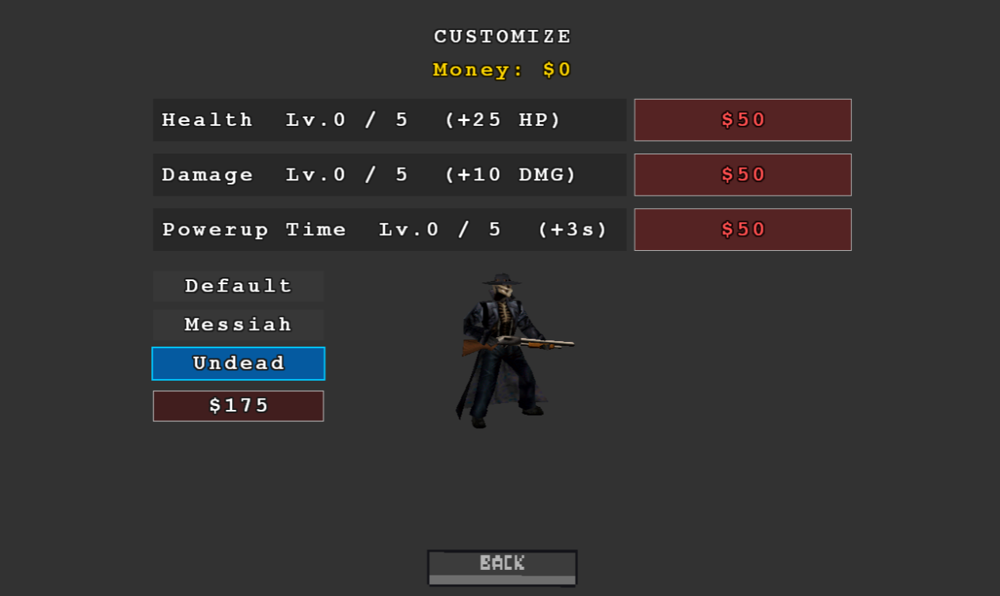

# Survive - Arena Shooter

A third-person timed survival shooter where you must survive 3 minutes against waves of increasingly dangerous enemies in a Colosseum arena. Built with C++ using Irrlicht Engine, Bullet Physics, and IrrKlang audio.

## Screenshots

### Main Menu


### Gameplay


### Customize Screen


| Basic Enemy | Fast Enemy | Fog Enemy |
|-------------|------------|-----------|
|  |  |  |

## Description

You are dropped into a Colosseum arena with a shotgun and 30 rounds. Enemies pour in through four gates in escalating waves. Your only goal: **stay alive for 3 minutes**.

Earn money from kills to upgrade your health, damage, and powerup duration in the shop. Collect ammo pickups and powerups scattered across the arena. Watch out for Fog Enemies that obscure your vision with grenade-launched fog clouds.

## Enemies

| Type | Health | Speed | Damage | Behavior |
|------|--------|-------|--------|----------|
| **Basic** | 50 HP | 160 | 10 | Spawns at gates, chases player, melee attack on contact |
| **Fast** | 25 HP | 270 | 5 | Faster and weaker variant, appears in later waves |
| **Fog** | 60 HP | 160 | -- | Throws fog grenades that reduce visibility for 10s, repositions around the arena |

### Wave Progression

| Wave | Duration | Enemies | Notes |
|------|----------|---------|-------|
| 1 | 0:00 -- 1:00 | Basic only | Low spawn rate, max 3 alive |
| 2 | 1:00 -- 2:00 | Basic + Fast | Medium spawn rate, max 6 alive |
| 3 | 2:00 -- 3:00 | Basic + Fast + Fog | High spawn rate, max 10 alive |

### Kill Rewards

| Enemy | Reward |
|-------|--------|
| Basic | $30 |
| Fast | $50 |
| Fog | $80 |

## Controls

| Action | Key |
|--------|-----|
| Move Forward | `W` |
| Move Backward | `S` |
| Strafe Left | `A` |
| Strafe Right | `D` |
| Look / Aim | Mouse Movement |
| Shoot | Left Mouse Button |
| Show Crosshair | Hold Right Mouse Button |
| Pause | `Esc` |
| Test Scene | `T` |

### Test Scene Controls

While in the test scene, you can manually spawn enemies at specific gates:

| Action | Key |
|--------|-----|
| Spawn Basic Enemy at Gate 1 | `1` |
| Spawn Basic Enemy at Gate 2 | `2` |
| Spawn Basic Enemy at Gate 3 | `3` |
| Spawn Basic Enemy at Gate 4 | `4` |
| Spawn Fast Enemy at Gate 1 | `5` |
| Spawn Fast Enemy at Gate 2 | `6` |
| Spawn Fast Enemy at Gate 3 | `7` |
| Spawn Fast Enemy at Gate 4 | `8` |
| Spawn Fog Enemy at Random Gate | `0` |
| Exit Test Scene | `Esc` |

## Dependencies

| Library | Version | Purpose |
|---------|---------|---------|
| [Irrlicht Engine](https://irrlicht.sourceforge.io/) | 1.8.5 | 3D rendering, scene management, GUI, input |
| [Bullet Physics](https://pybullet.org/wordpress/) | 3.x | Rigid body physics, collision detection, ghost objects |
| [IrrKlang](https://www.ambiera.com/irrklang/) | 1.6+ | 3D audio playback (MP3, WAV, OGG) |

All libraries are included in the `libs/` directory. No external downloads needed.

## Building with CMake

### Requirements

- **Windows 10/11** (x64)
- **Visual Studio 2022** with C++ desktop development workload
- **CMake 3.16+**

### Build Steps

```bash
# Clone the repository
git clone https://github.com/petaaar88/survive-arena-shooter.git
cd survive-arena-shooter

# Configure (generates VS2022 solution)
cmake --preset x64-debug

# Build
cmake --build build --config Debug
```

For Release:

```bash
cmake --preset x64-release
cmake --build build --config Release
```

The executable is output to `bin/x64/Debug/` or `bin/x64/Release/`. DLLs and assets are copied automatically by the post-build step.

### Running

```bash
# From the project root (working directory must be the repo root for assets/ to load)
./bin/x64/Debug/Survive.exe
```

Or open `build/Survive.sln` in Visual Studio, set **Survive** as the startup project, and press F5. The debugger working directory is already configured to the project root.

### Alternative: Open with Visual Studio Directly

Visual Studio 2022 can open the CMake project directly:

1. **File > Open > Folder** and select the repository root
2. VS detects `CMakeLists.txt` and `CMakePresets.json` automatically
3. Select the `x64-debug` or `x64-release` preset from the toolbar
4. **Build > Build All** (`Ctrl+Shift+B`)
5. **Debug > Start Debugging** (`F5`)

## Project Structure

```
survive-arena-shooter/
├── CMakeLists.txt          # Build configuration
├── CMakePresets.json        # x64 Debug/Release presets
├── README.md
├── src/
│   ├── main.cpp             # Entry point
│   ├── Game.h/cpp           # Main loop, state machine, HUD, spawning
│   ├── GameObject.h/cpp     # Base class: Irrlicht node + Bullet body
│   ├── Player.h/cpp         # Third-person player: movement, shooting, health
│   ├── Enemy.h/cpp          # Basic & Fast enemy AI
│   ├── FogEnemy.h/cpp       # Fog grenade enemy
│   ├── Pickup.h/cpp         # Ammo pickups
│   ├── Powerup.h/cpp        # Timed powerup buffs
│   ├── Physics.h/cpp        # Bullet physics world wrapper
│   ├── InputHandler.h       # Keyboard & mouse input
│   └── DebugDrawer.h/cpp    # Physics debug visualization
├── assets/
│   ├── models/              # MD2 player & enemy models with PCX skins
│   ├── maps/                # Colosseum arena (.obj) and gate meshes
│   ├── textures/            # HUD, skybox, UI buttons, powerup icons
│   └── audio/               # Sound effects and music (.mp3)
├── libs/
│   ├── irrlicht-1.8.5/      # include/, lib/, bin/
│   ├── irrKlang/            # include/, lib/, bin/
│   └── bullet3/             # include/, lib/
└── bin/                     # Build output (executables + copied DLLs)
```

## License

This project was created for the CS445 - Software Environments for Game Development course.
